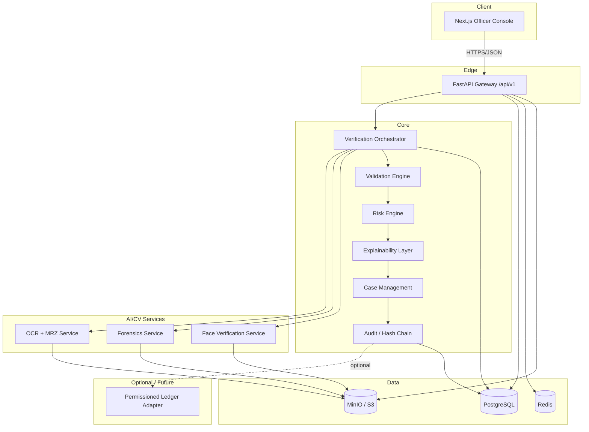
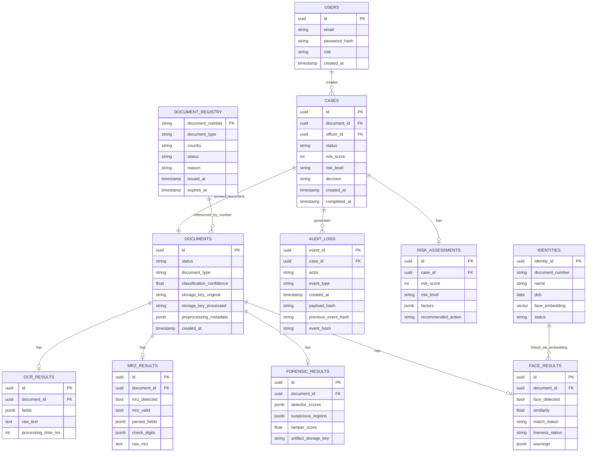
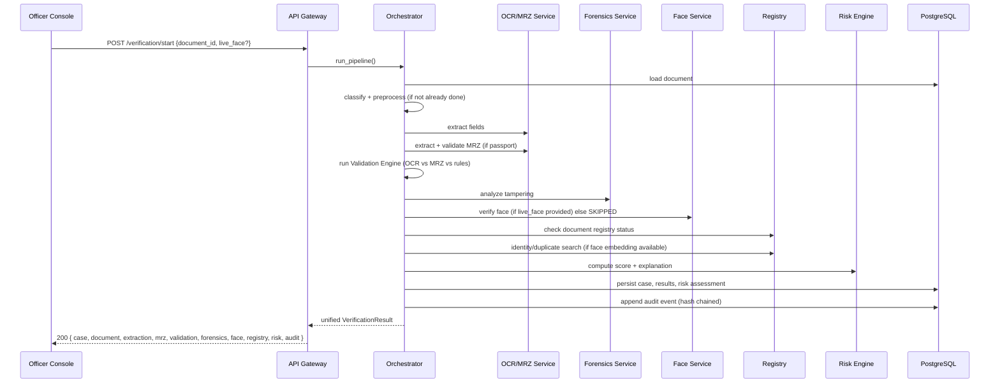
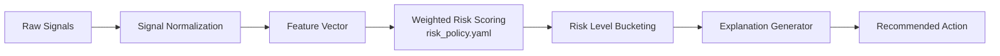
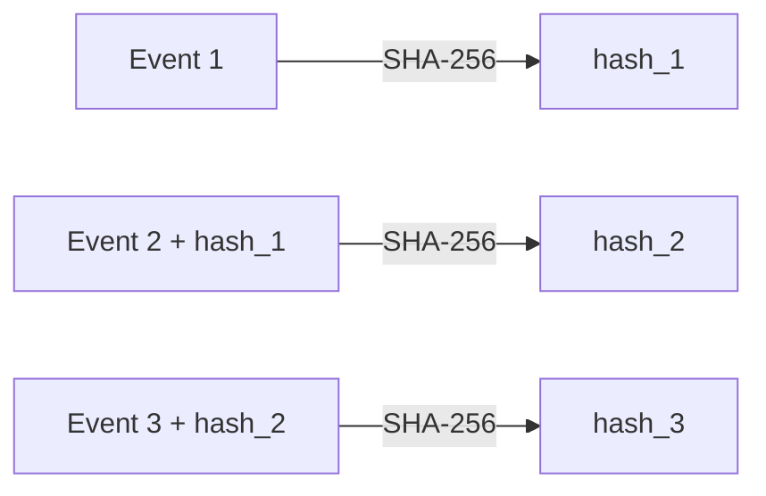

# VERIDEX — Technical Architecture Specification

**Project:** VERIDEX — AI-Powered Fake Identity & Document Screening System
**Reference:** SIH Problem Statement 26188
**Document purpose:** Authoritative architecture reference for an AI coding agent (OpenCode) implementing the system. This is the source of truth for structure, contracts, and phasing — the agent should re-read the relevant section before implementing each module.

---

## 0. Product framing and non-negotiable constraints

VERIDEX is an **officer decision-support system**, not an autonomous enforcement system.

- The system never asserts a document is definitively forged. It surfaces **risk indicators**, **verification mismatches**, and a **recommended action** (`CLEAR`, `MANUAL_REVIEW`, `SECONDARY_INSPECTION`, `HIGH_RISK_ALERT`).
- All identity/document data used in development is **synthetic**. No real PII, ever, in the repo, seed data, fixtures, or tests.
- PII (raw images, DOB, address, face images) is **never** sent to any ledger/blockchain component — only hashes and minimal metadata.
- No stage's failure should be fatal to the whole pipeline unless it is a hard dependency (e.g., OCR failing on an unreadable image); optional stages degrade to `SKIPPED` with an explanation.
- MVP must run entirely locally via `docker compose up --build` — no Kubernetes, Kafka, GPU, or paid cloud API required to demo.

---

## 1. High-level system architecture



**Key architectural rule:** the frontend **never** calls the OCR, Forensics, or Face services directly. All requests go through the FastAPI gateway, and all cross-service coordination happens inside the Verification Orchestrator. This keeps the AI services independently replaceable/scalable and gives one place to enforce auth, audit, and error handling.

---

## 2. Repository layout

```
veridex/
├── apps/
│   └── web/                      # Next.js 14+ (App Router), TypeScript, Tailwind
├── services/
│   ├── api/                      # FastAPI gateway + orchestrator + core domain logic
│   ├── ocr/                      # PaddleOCR + MRZ extraction/parsing microservice
│   ├── forensics/                # ELA, copy-move, compression, metadata detectors
│   ├── face/                     # Face detect/embed/compare/liveness
│   ├── risk/                     # Risk scoring + explanation (can be in-process lib first)
│   └── registry/                 # Synthetic document/identity registry
├── packages/
│   └── contracts/                # Shared Pydantic/OpenAPI/TS types generated or hand-synced
├── infrastructure/
│   ├── docker/                   # Dockerfiles per service
│   └── postgres/                 # init SQL, migration bootstrap
├── data/
│   └── synthetic/                # synthetic documents, faces, MRZ fixtures, registry seed
├── tests/
│   ├── unit/
│   ├── integration/
│   └── e2e/
├── scripts/
│   └── seed_demo.py
├── docs/
│   ├── SIH_READINESS.md
│   ├── performance.md
│   └── SECURITY.md
├── docker-compose.yml
├── .env.example
├── Makefile
└── README.md
```

Do not scaffold every directory at once — create it incrementally, phase by phase (see §11).

---

## 3. Technology stack

| Layer | Technology |
|---|---|
| Frontend | Next.js, React, TypeScript, Tailwind CSS, shadcn/ui, Recharts, Lucide icons |
| Backend/API | Python, FastAPI, Pydantic, SQLAlchemy, Alembic |
| AI/CV | OpenCV, PaddleOCR, custom MRZ parser, PyTorch (where needed), InsightFace (or equivalent), scikit-learn, NumPy, Pillow |
| Data | PostgreSQL, Redis, MinIO (S3-compatible) |
| Infra | Docker, Docker Compose |
| Security | JWT auth, RBAC, bcrypt/Argon2, SHA-256 hash chaining, strict upload validation, rate limiting |
| Optional/future | Hyperledger Fabric or other permissioned ledger, Kafka, Kubernetes, GPU inference, real registry APIs |

---

## 4. Service responsibilities

### 4.1 `apps/web` — Officer Console (Next.js)
Renders the operator experience only. Talks exclusively to `services/api`. Owns no business logic beyond client-side form/state handling and presentation of API-returned data. Never hardcodes verification results.

### 4.2 `services/api` — Gateway + Orchestrator
- Auth (JWT), RBAC (`OFFICER`, `SUPERVISOR`, `ADMIN`, `AUDITOR`)
- `/api/v1/*` REST surface
- Owns PostgreSQL models: `users`, `roles`, `documents`, `cases`, `audit_logs`, `document_registry`, `identities`
- Hosts the **Verification Orchestrator** (state-machine pipeline, §6)
- Hosts **Validation Engine**, **Risk Engine**, **Explainability Layer**, **Case Management**, **Audit/Hash Chain** as in-process modules (they can later be split into standalone services without changing the external API contract)

### 4.3 `services/ocr`
Input: preprocessed image. Output: structured field extraction + MRZ parse/validation. Exposes `POST /ocr/v1/extract` and `POST /ocr/v1/mrz`. Called only by the orchestrator, never by the frontend.

### 4.4 `services/forensics`
Input: document image + context (document type, regions of interest). Output: per-detector findings (ELA, copy-move, compression anomaly, metadata, portrait-region, text-region) plus a fused tampering indicator score and visual artifacts (heatmaps). Exposes `POST /forensics/v1/analyze`.

### 4.5 `services/face`
Input: document portrait + live/user face image. Output: detection, quality, embedding similarity, match status, prototype liveness signal. Exposes `POST /face/v1/verify` and `POST /face/v1/embed` (used by identity search in `registry`).

### 4.6 `services/registry`
Synthetic document status registry (`VALID/EXPIRED/REVOKED/BLACKLISTED/LOST/UNKNOWN`) and synthetic identity/face-embedding store for duplicate-identity search. Exposes `GET /registry/v1/documents/{document_number}` and `POST /registry/v1/identity/search`.

---

## 5. Core data model (PostgreSQL)



---

## 6. Verification pipeline (orchestrator state machine)



**Stage contract:** every stage returns `{status: SUCCESS|WARNING|FAILED|SKIPPED, data, warnings[]}`. A `SKIPPED`/`WARNING` in an optional stage (face, registry) must not throw; it must be reflected in the final risk explanation (e.g., "Biometric verification unavailable").

**Document processing states:** `UPLOADED → CLASSIFYING → PREPROCESSING → EXTRACTING → VALIDATING → FORENSIC_ANALYSIS → FACE_VERIFICATION → RISK_ASSESSMENT → COMPLETED | FAILED`

---

## 7. Risk engine design



**Signals consumed:** `ocr_confidence`, `mrz_valid`, `mrz_mismatch_count`, `expired`, `registry_status`, `tamper_score`, `face_similarity`, `face_match`, `liveness_status`, `identity_link_score`, `validation_error_count`.

**Weights live in `risk_policy.yaml`**, not hardcoded in Python — grouped by category (`document_validation`, `tampering`, `identity`, `registry`). Document explicitly in the repo that these are unvalidated prototype defaults requiring calibration before real deployment.

**Risk levels:** `0–29 LOW`, `30–59 MEDIUM`, `60–79 HIGH`, `80–100 CRITICAL`.

Output must always include **both** positive and negative factors (e.g., "face matched" alongside "MRZ mismatch") — never a bare number.

---

## 8. Audit integrity (hash chain)



`POST /api/v1/audit/verify/{case_id}` recomputes the chain and returns `{chain_valid, events_checked, first_invalid_event, details}`. Tests must intentionally corrupt a record and assert verification fails.

The ledger adapter (`AuditLedger` interface, default `LocalHashLedger`, future `HyperledgerFabricLedger`) receives **only** `{case_id, audit_root_hash, timestamp, system_id}` — never PII.

---

## 9. API surface (v1)

| Method | Path | Purpose |
|---|---|---|
| GET | `/api/v1/health`, `/api/v1/ready` | liveness/readiness |
| POST | `/api/v1/auth/login` | JWT auth |
| POST | `/api/v1/documents/upload` | ingest document |
| POST | `/api/v1/documents/{id}/preprocess` | run OpenCV pipeline |
| POST | `/api/v1/documents/{id}/classify` | document type detection |
| GET | `/api/v1/documents/{id}` | document + derived results |
| POST | `/api/v1/documents/{id}/mrz` | MRZ parse/validate |
| POST | `/api/v1/documents/{id}/validate` | run validation engine |
| POST | `/api/v1/documents/{id}/forensics` / GET | tamper analysis |
| POST | `/api/v1/face/verify` | face match |
| POST | `/api/v1/identity/search` | duplicate identity search |
| GET | `/api/v1/registry/documents/{document_number}` | registry status |
| POST | `/api/v1/verification/start` | full orchestrated pipeline |
| POST/GET/PATCH | `/api/v1/cases`, `/api/v1/cases/{id}` | case lifecycle |
| GET | `/api/v1/audit/cases/{case_id}` | audit timeline |
| POST | `/api/v1/audit/verify/{case_id}` | chain integrity check |
| POST/GET | `/api/v1/ledger/cases/{id}/anchor` \| `/verify` | optional ledger anchor |

---

## 10. Frontend routes and UI structure

```
/login
/dashboard
/verify
/cases
/cases/[id]
/cases/[id]/forensics
/audit
/registry
/system
```

Dashboard cards: Total verifications, Low risk, Manual review, High risk, Critical alerts, plus a recent-verifications table (Case ID, Document, Subject, Risk, Status, Timestamp, Officer).

New Verification flow shows live pipeline progress:
```
DOCUMENT INGESTION       ✓
CLASSIFICATION           ✓
OCR EXTRACTION           ✓
MRZ VALIDATION           ✓
FORENSIC ANALYSIS        ●
FACE VERIFICATION        ○
RISK ASSESSMENT          ○
```

Results page sections: Document, Validation, Forensics (with ELA heatmap viewer, zoom/pan, suspicious-region overlays), Biometrics, Registry, Risk (score + explicit reasons list), Decision banner. Visual design: professional security-console aesthetic (dark/light), high information density, explicit `LOW/MEDIUM/HIGH/CRITICAL` badges that don't rely on color alone. Include a demo-scenario selector (Genuine / Tampered / Impersonation / Blacklisted / Expired) that loads real API data — never hardcoded UI results.

---

## 11. Implementation roadmap (phased, sequential)

Each phase must be **fully working and tested** before the next starts. Do not let the agent skip ahead while a phase is broken.

1. **Foundation** — repo scaffold, Docker Compose (web/api/postgres/redis/minio), health/ready endpoints, auth skeleton, RBAC models, base tables (`users, roles, cases, documents, audit_logs`).
2. **Frontend shell** — routes, sidebar/topbar, dashboard cards wired to (initially empty) API, typed API client, loading/empty/error states.
3. **Ingestion & preprocessing** — secure upload → MinIO, OpenCV preprocessing pipeline (orientation, boundary detect, perspective transform, crop, denoise, contrast), quality metadata.
4. **Classification** — `DocumentClassifier` interface with heuristic/lightweight baseline, `UNKNOWN` fallback, confidence thresholds.
5. **OCR service** — PaddleOCR integration, per-document-type field configs (passport/visa fields), bbox + confidence persistence.
6. **MRZ engine** — TD3 MRZ detection/OCR/parsing/check-digit validation, visual-vs-MRZ comparison table.
7. **Validation engine** — rule abstraction (`ValidationRule` → `severity, passed, message, evidence`), date/format/consistency rules; rules emit findings only, **not** risk scores.
8. **Forensics engine** — ELA, copy-move, compression anomaly, metadata, portrait-region, text-region detectors behind a common `ForensicDetector` interface; weighted evidence fusion; heatmap artifact generation.
9. **Face verification** — portrait extraction, face detect/quality/embedding/similarity, configurable threshold, prototype liveness clearly labeled as such.
10. **Identity duplicate search** — synthetic identity store, embedding similarity search (NumPy/pgvector-ready abstraction), `POTENTIAL_IDENTITY_LINK` output (never a definitive claim).
11. **Registry service** — synthetic document status store + admin seed endpoints.
12. **Risk engine** — signal normalization, `risk_policy.yaml` weights, level bucketing, explanation generator.
13. **Case management** — case CRUD, status/decision enums, full event timeline.
14. **Audit trail** — SHA-256 hash chaining, chain verification endpoint, corruption tests.
15. **Ledger abstraction** (optional/last) — `AuditLedger` interface, `LocalHashLedger` default, Fabric adapter stub, hash-only payload.
16. **Orchestrator** — stage-based pipeline wiring stages 3–14 together with per-stage `SUCCESS/WARNING/FAILED/SKIPPED` semantics and partial-failure tolerance.
17. **Demo dataset** — reproducible synthetic scenarios: Genuine, Tampered, Impersonation, Blacklisted, Expired, Multiple-identity; `scripts/seed_demo.py`.
18. **UI polish** — forensic heatmap viewer, explainable risk panel, timeline, demo-scenario selector.
19. **Security hardening** — RBAC/IDOR checks, upload validation, secret hygiene, PII-in-logs review, `SECURITY.md`.
20. **Testing** — unit (parsers, rules, risk boundaries, hash chain), integration (per-stage), e2e (all six scenarios), security tests, measured (not invented) performance numbers in `docs/performance.md`.
21. **Dockerization** — full `docker compose up --build`, Makefile targets (`up/down/logs/test/lint/seed-demo/clean`).
22. **Final audit pass** — classify every claimed feature as `IMPLEMENTED / PARTIALLY IMPLEMENTED / MOCK / NOT IMPLEMENTED / BROKEN`, fix top issues, produce `docs/SIH_READINESS.md`.

---

## 12. Engineering rules for the coding agent

- Inspect before modifying; never silently delete or replace working code.
- Justify any new dependency; prefer mature open-source libraries; pin versions.
- Every feature has a typed API contract (Pydantic backend / TypeScript frontend) before UI wiring.
- Don't fake AI outputs where a real (even simple, deterministic-baseline) implementation is feasible — isolate any baseline behind an interface so it's swappable later (e.g., classifier, liveness).
- No hardcoded secrets; all config via environment variables (`.env.example` kept current).
- Structured logging; correlation/request IDs; no PII in logs.
- After each phase: run tests, type-check, lint, verify Docker build, and report what changed + known limitations before proceeding.

---

## 13. Definition of done for the MVP demo

The following chain must work end-to-end on a clean machine via `docker compose up --build` + `make seed-demo`:

```
UPLOAD → CLASSIFY → PREPROCESS → OCR → MRZ → VALIDATE → FORENSICS →
EXTRACT PHOTO → FACE VERIFICATION → REGISTRY CHECK → RISK ENGINE →
EXPLAINABLE RESULT → CASE CREATED → AUDIT HASH
```

And all six demo scenarios (Genuine, Tampered, Impersonation, Blacklisted, Expired, Multiple-identity) must be reproducible and reflected accurately in the UI, sourced from real API responses — not hardcoded.